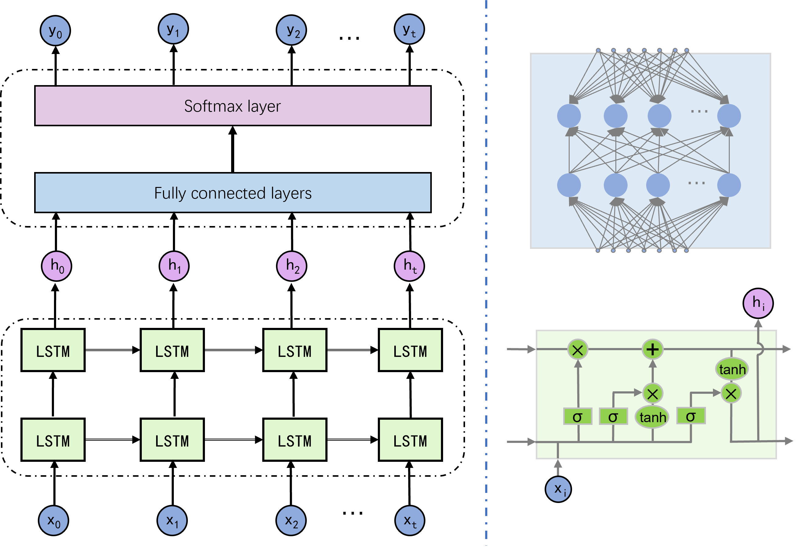

# Denoising of event-based sensors with deep neural networks

By: [Zhihong Zhang](https://github.com/dawnlh)

This repository contains the code for the project **Denoising of event-based sensors with deep neural networks**. My bachelor's thesis  and a Photonics Asia 2021 conference paper are based on the project.

## Introduction

The event-based sensor is a novel class of asynchronous imaging sensor based on neuromorphic vision. Inspired by human being’s retina, the sensor is only sensitive to the region with brightness changes and outputs event sequences containing information of changing positions, time and polarities in a special form named address-event-representation (AER). Compared with traditional cameras, event cameras have many advantages, such as low power consumption, low temporal latency and large dynamic range, which provide them with great potential applications in auto-driving, high-speed target detection and tracking and so on. However, the low signal to noise ratio (SNR) of original event sequences seriously limits event cameras’ performance in actual scenarios. Besides, due to event camera’s special data form of AER, traditional frame-based image denoising methods are unsuitable for event camera’s denoising. 

In recent years, deep learning based approaches have been wildly used in many visual tasks and achieve great success. To bridge the gap between event-based sensors and real scenario applications, we proposed two deep neural network based denoising methods for event-based sensors, i.e., Convolutional Denoising Auto-Encoder (ConvDAE) and Sequence segmentation Recurrent Neural Network (SeqRNN). ConvDAE converts the event sequence into 2D images and then involves an auto-encoder for denoising, which makes it compatible with existing deep denoisers and high-level vision tasks. SeqRNN utilizes recurrent neural network’s advantages in dealing with long-term temporal sequence to realize online denoising while keep the event’s original AER representation form. We carry out simulated and real experiments on different datasets, and both simulation and real data experiments demonstrate that proposed methods can successfully complete the denoising task of the event camera, and meet the application requirements in corresponding scenarios.  

## Methods & results

### Convolutional Denoising Auto-Encoder (ConvDAE) 

ConvDAE converts the event sequence into 2D images and then involves an auto-encoder for denoising, which makes it compatible with existing deep denoisers and high-level vision tasks. 

### Sequence segmentation Recurrent Neural Network (SeqRNN)

SeqRNN utilizes recurrent neural network’s advantages in dealing with long-term temporal sequence to realize online denoising while keep the event’s original AER representation form. 

## Note

- All codes are converted into .py scripts, and .ipynb files will not be updated (and are out of date).

## Citation